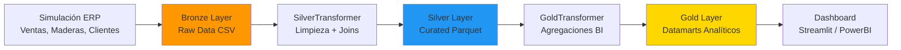

---

**Autor:** Maycol 
**Curso:** Ingeniería de datos en plataformas en la nube y Data warehousing con Python  
**Institución:** BSG Institute  
**Cloud:** AWS / GCP / Azure (Deployment Multicloud)  
**Fecha:** Mayo 2026

---

## Tabla de Contenidos
1. [Resumen del Proyecto](#resumen-del-proyecto)
2. [Arquitectura del Pipeline](#arquitectura-del-pipeline)
3. [Estructura de Datos (Medallion Architecture)](#estructura-de-datos-medallion-architecture)
4. [Cómo Ejecutar Localmente](#cómo-ejecutar-localmente)
5. [Guía de Deploy Multicloud](#guía-de-deploy-multicloud)
6. [Decisiones Técnicas Clave](#decisiones-técnicas-clave)
7. [Estructura del Proyecto](#estructura-del-proyecto)
8. [Documentación Adicional](#documentación-adicional)

---

## Resumen del Proyecto

Pipeline Analítico Avanzado (ETL end-to-end) para una empresa maderera peruana. El pipeline simula y ejecuta el ciclo de vida completo de los datos utilizando el patrón de diseño **Medallion Architecture** (Bronze/Silver/Gold). 

**Qué hace:** 
1. Genera cientos de miles de transacciones históricas simuladas de un ERP bajo lógicas reales de mercado.
2. Asegura la integridad y calidad de los datos limpiando y unificando registros de ventas y clientes.
3. Produce **Datamarts analíticos** (Rentabilidad Global y Estrategia Promocional Automática) optimizados en formato Parquet, listos para integrarse y visualizarse velozmente en Dashboards y herramientas de Inteligencia de Negocios.

---

## Arquitectura del Pipeline

### Diagrama Lógico



### Mapeo a Tecnologías y Servicios

| Capa | Herramienta / Formato |
|------|-----------------------|
| **Ingesta** | Generador Python (`Faker` + Simulación algorítmica) |
| **Bronze** | Almacenamiento Local / Bucket S3 (Archivos `.csv`) |
| **Silver** | Python OOP / `pyarrow` (Archivos `.parquet` + Compresión Snappy) |
| **Gold** | Motor de agrupaciones Pandas / Archivos `.parquet` |
| **Serving** | Streamlit Dashboard / PowerBI |
| **Orquestación** | Python Subprocess `main_pipeline.py` (Procesamiento Aislado) |
| **Despliegue (CI/CD)** | Docker, GitHub Actions, AWS Fargate, GCP Cloud Run, Azure ACI |

---

## Estructura de Datos (Medallion Architecture)

### 🥉 Bronze Layer (Raw Zone)
- **Script asociado:** `generador_bronze.py`
- **Propósito:** Repositorio inmutable de datos crudos tal cual se importan del ERP transaccional simulado. Simula años de operaciones de ventas incluyendo inflación interanual, descuentos dinámicos y picos estacionales.
- **Ubicación:** `data/bronze/` subdividido en clientes, maderas, ventas_cabecera, ventas_detalle.

### 🥈 Silver Layer (Curated Zone)
- **Script asociado:** `procesador_silver.py` / `src.silver.transformers`
- **Propósito:** Sistema "Single Source of Truth". Datos validados, enriquecidos y limpios.
- **Transformaciones:** Estandarización de cadenas de texto, Mega-Join de relación transaccional (Cabecera + Detalles de Venta), e inyección de Feature Engineering temporal (Mes, Año, Trimestre).
- **Ubicación:** `data/silver/` guardado como Parquet (`dim_clientes.parquet`, `dim_maderas.parquet`, `fact_ventas_unificadas.parquet`).

### 🥇 Gold Layer (Serving Zone)
- **Script asociado:** `procesador_gold.py` / `src.gold.transformers`
- **Propósito:** Tablas dinámicas maestras altamente agregadas y desnormalizadas listas para el reporte BI.
- **Datamarts generados:**
  1. **Rentabilidad Global:** Agrupaciones paramétricas de ingresos y volúmenes por jerarquía de tiempo y especie.
  2. **Recomendador de Promociones:** Analizador automático que define, según percentiles de venta mensual, si un producto necesita ir a "Liquidación 3x1" o ser una "Campaña Estrella".
- **Ubicación:** `data/gold/`

---

## Cómo Ejecutar Localmente

### 1. Prerrequisitos
- Python 3.9+
- Git

### 2. Clonar el repositorio e instalar
```bash
git clone <url-del-repo>
cd ProyectoIngeneiadeDatos

# 1. Crear entorno virtual y activarlo
python -m venv venv
.\venv\Scripts\activate   # En Windows
# source venv/bin/activate # En Mac/Linux

# 2. Instalar el núcleo y dependencias
pip install --upgrade pip setuptools wheel
pip install -r requirements.txt
```

### 3. Ejecutar el pipeline completo
Un solo comando lanza nuestro orquestador maestro, el cual disparará Bronze, Silver y Gold de manera secuencial.
```bash
python main_pipeline.py
```

### 4. Verificar resultados
Revisa la consola. Si el orquestador reporta éxito (Exit code 0), tus Datamarts y tableros analíticos estarán listos en la carpeta `/data/gold/`.

---

## Guía de Deploy Multicloud

El proyecto viene Dockerizado en la carpeta `/ops` y amarrado a **GitHub Actions**, listo para compilarse y ejecutarse automáticamente como un contenedor de tipo `Batch Job`. Dependiendo de tu proveedor Cloud favorito, ejecuta el workflow correspondiente:

> **NOTA DE VOLUMEN:** Localmente, el guardado apunta a la carpeta local `/data/`. Para uso de Big Data en producción, el sistema asume que inyectarás un Bucket de S3 o Azure Blob Storage como punto de montaje.

### 🟣 AMAZON WEB SERVICES (AWS ECS Fargate)
1. En GitHub ve a `Settings > Secrets` y agrega: `AWS_ACCESS_KEY_ID`, `AWS_SECRET_ACCESS_KEY`, `SUBNET_ID`, `SG_ID`.
2. Dirígete a la pestaña **Actions**, selecciona `Deploy to AWS ECS` y haz clic en *Run workflow*.
3. GitHub compilará el código, subirá la imagen al Elastic Container Registry (ECR) y correrá el pipeline en un clúster *Fargate Serverless* que se apaga automáticamente al terminar, optimizando costos.

### 🟡 GOOGLE CLOUD PLATFORM (Cloud Run Jobs)
1. Configura en Secrets de GitHub: `GCP_PROJECT_ID` y `GCP_CREDENTIALS` (Clave de cuenta de servicio).
2. Ejecuta el workflow `Deploy to Google Cloud Run Jobs`.
3. Tu tubería se subirá a Artifact Registry y será procesada por Cloud Run Jobs de GCP.

### 🔵 MICROSOFT AZURE (Container Instances)
1. Inserta tus credenciales en los Secrets: `AZURE_CREDENTIALS`, `ACR_USERNAME`, `ACR_PASSWORD`.
2. Lanza el pipeline a través del workflow `Deploy to Azure Container Instances`.
3. Esto generará un contenedor ACI con política de *Restart-Never*, perfecto para correr procesos de Calidad de Datos aislados.

---

## Decisiones Técnicas Clave

1. **¿Por qué utilizar Parquet?**  
   El uso del formato binario y columnar de Parquet junto con el algoritmo de compresión Snappy disminuye el tamaño de almacenamiento en nube (hasta un 90% menos de peso en comparación a CSV). Asimismo, las lecturas en la capa Gold se aceleran exponencialmente.

2. **¿Por qué Python Orientado a Objetos (OOP)?**  
   Encapsular la lógica en clases como `SilverTransformer` y `GoldTransformer` brinda ventajas únicas de testeo y mantenimiento. Previene el "Código Espagueti", clásico en Jupyter Notebooks.

3. **Orquestación mediante Aislamiento de Procesos (`main_pipeline.py`)**  
   Llamar a los scripts a través de `subprocess` asegura que la memoria (RAM) consumida durante el pesado Join de la etapa Silver sea completamente destruida y liberada del sistema operativo antes de arrancar la etapa Gold, evitando cuellos de botella (OOM Errors).

---

## Estructura del Proyecto

```text
ProyectoIngeneiadeDatos/
├── .github/
│   └── workflows/           # Configuración de tuberías CI/CD Multicloud
├── architecture/            # Archivos de diagramación técnica (Markdown/PDF)
│   └── arquitectura_maderera.md
├── data/                    # Simulador Data Lake (Volumen persistente)
│   ├── bronze/              # Zona Raw CSVs
│   ├── silver/              # Zona Estandarizada Parquets
│   └── gold/                # Datamarts para Consumo
├── docs/                    # Archivos y guías de instalación complementaria
├── ops/                     # Herramientas de despliegue y Dockerfile
├── src/                     # Código de Core / Funciones de Transformación
│   ├── silver/
│   │   ├── config.py
│   │   └── transformers.py
│   └── gold/
│       ├── config.py
│       └── transformers.py
├── generador_bronze.py      # Extract/Simulador Transaccional
├── procesador_silver.py     # Clean & Format
├── procesador_gold.py       # Creación de Inteligencia de Negocio
├── dashboard.py             # App en Streamlit (Opcional)
├── main_pipeline.py         # Orquestador Python Maestro
├── requirements.txt         # Entorno Virtual
└── README.md                # Presentación Principal
```

---

## Documentación Adicional

- **Diseño Detallado del Pipeline:** [architecture/arquitectura_maderera.md](architecture/arquitectura_maderera.md)
