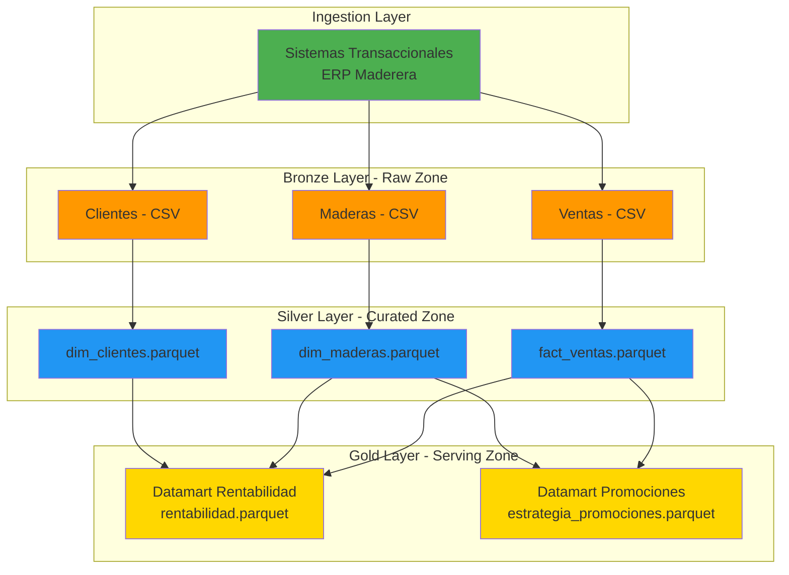
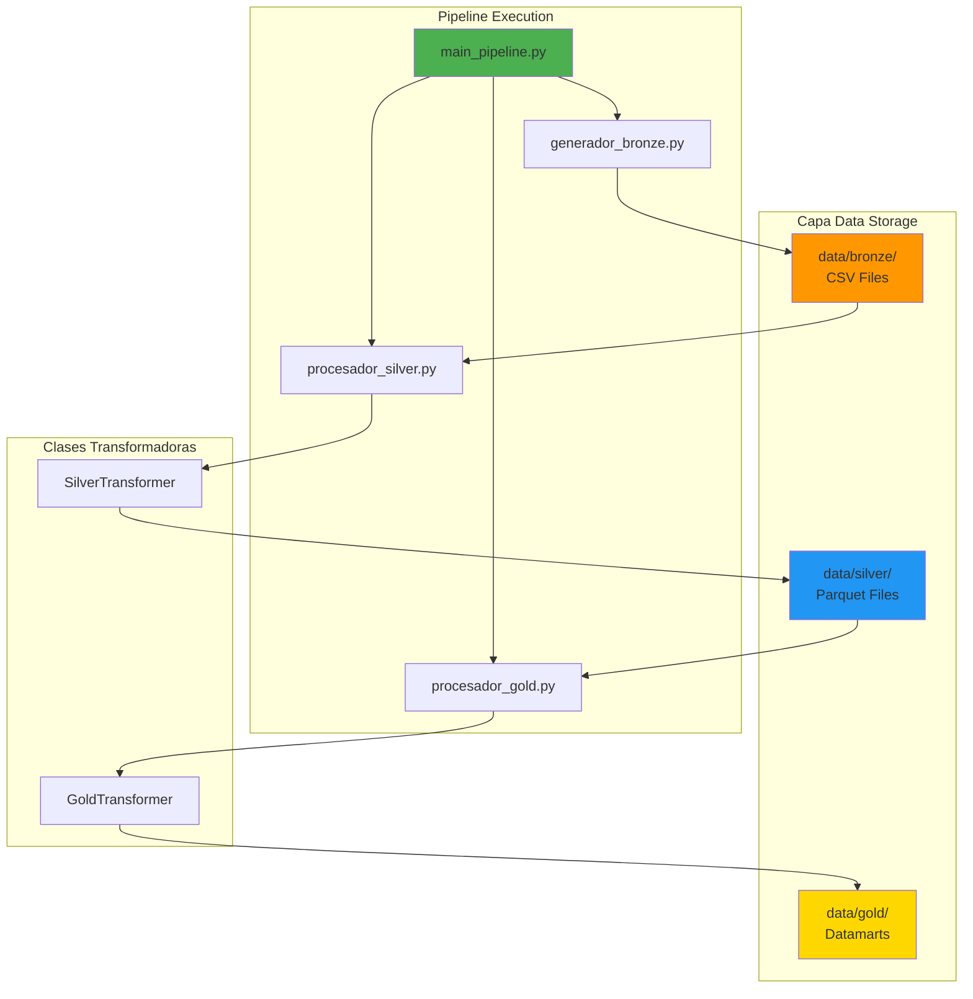

# Python Data Engineer  
**Curso:** Ingeniería de datos en plataformas en la nube y Data warehousing con Python  
**Proyecto:** Final primera entrega Arquitectura del sistema  

**Docente:** Andrés Felipe Rojas Parras  
**Alumno:** Maycol  

---

# Arquitectura del Pipeline

## Descripción general del flujo

El pipeline integra sistemas transaccionales simulados para construir un dataset analítico confiable de una empresa maderera usando la arquitectura **Medallion (Bronze/Silver/Gold)**. El objetivo es mantener trazabilidad absoluta de las operaciones (raw), mejorar la calidad y estandarizar datos (curated), y entregar métricas listas para el consumo (serving).

**Entradas (Data Sources)**
- **ERP Maderera (Simulado):** Archivos CSV crudos generados (Clientes, Maderas, Ventas Cabecera y Ventas Detalle). 

**Ejecución del pipeline (Pipeline Execution)**
1. **Extract:** Ejecución de `generador_bronze.py` que emula el sistema transaccional, generando miles de registros con variables de estacionalidad e inflación.
2. **Bronze Layer (Raw Data):** Se almacenan todas las fuentes sin alterar su contenido original (`CSV` puros).
   - Salida particionada por entidad en `data/bronze/`.
3. **Transform (Clean + Validate):** Aplicación de reglas de calidad y programación orientada a objetos (OOP) con `SilverTransformer`:
   - Estandarización de formatos y tipos de datos.
   - Joins entre transacciones cabecera y detalle.
4. **Silver Layer (Curated Data):** Dataset limpio y unificado, guardado en formato **Parquet** con compresión Snappy en `data/silver/`.
5. **Transform (Aggregate):** Motor `GoldTransformer` para el cálculo de métricas de negocio:
   - Datamart de Rentabilidad (ingresos y volúmenes agrupados por jerarquía de tiempo y especie).
   - Datamart de Promociones (recomendador basado en percentiles de rendimiento).
6. **Gold Layer (Analytics Ready):** Datamarts listos para consumo BI. Exportados a `CSV` y `Parquet`.

**Propiedades de diseño**
- **Trazabilidad:** Bronze conserva el dato "tal cual llegó".
- **Calidad y consistencia:** Silver aplica limpieza y unificación.
- **Consumo analítico:** Gold entrega Datamarts listos para dashboards.
- **Eficiencia:** Parquet reduce drásticamente el tamaño en disco (~10x) y acelera lecturas.

## Arquitectura Medallion (Bronze/Silver/Gold)



La idea es simple: Bronze = datos crudos, Silver = limpio, Gold = listo para análisis.

## Servicios / Herramientas que uso

| Herramienta / Servicio | Para qué lo uso |
|------------------------|-----------------|
| **Python (Pandas)** | Motor principal de procesamiento en memoria. |
| **PyArrow / Fastparquet** | Para escribir y leer en formato Parquet comprimido (Snappy). |
| **Docker** | Contenerización del proyecto para despliegue. |
| **AWS EC2 / App Runner** | (Futuro) Hostear el Dashboard de Streamlit. |
| **GitHub Actions** | (Futuro) Pipeline CI/CD para automatizar despliegues. |

## Flujo del pipeline

### Paso 1: Extracción / Capa Bronze
```python
# Ejecución del generador simulado
run_script('generador_bronze.py')
```
**Características:**
- Simula ~2 años de operaciones de ventas reales.
- Genera catálogo de maderas, cartera de clientes y miles de detalles de transacción.

### Paso 2: Fase de Transformación Silver
```python
transformer = SilverTransformer()
df_fact_ventas = transformer.process_ventas_marketing(df_cabecera, df_detalle)
df_fact_ventas.to_parquet('data/silver/fact_ventas.parquet', engine='pyarrow', compression='snappy')
```
**Operaciones:**
1. Lee los datos crudos desde Bronze.
2. Unifica cabeceras y detalles.
3. Convierte y asegura los `dtypes` adecuados para eficiencia de memoria.

### Paso 3: Fase de Transformación Gold
```python
transformer = GoldTransformer()
dm_rentabilidad = transformer.process_dm_rentabilidad(df_fact, df_maderas)
dm_promociones = transformer.process_dm_promociones(df_fact, df_maderas)
```
**Operaciones:**
- Agrupa la fact_table enriquecida con `dim_maderas`.
- Calcula rentabilidad histórica y genera recomendaciones automatizadas de marketing (Liquidaciones 3x1 o Campañas Estrella).

## Riesgos y cómo los manejo

| Qué puede fallar | Qué tan probable | Qué hago |
|------------------|------------------|----------|
| **Falta de Memoria (OOM)** | Medio | Uso `main_pipeline.py` para correr scripts con aislamiento de procesos. |
| **Pérdida de Performance** | Alto | Conversión temprana a formato `Parquet` en Capa Silver. |
| **Duplicidad Transaccional**| Medio | Estandarización de IDs y joins con llaves maestras en `SilverTransformer`. |

## Logs y debugging

El orquestador `main_pipeline.py` controla la visibilidad mediante prints claros, estructurados por etapas:
```text
==================================================
| RE | INICIANDO JOB: generador_bronze.py
==================================================
Generando catálogo de Maderas...
Generando Clientes...
[XITO] Job generador_bronze.py completado en 3.52 segundos.

[ETAPA 1: LECTURA / EXTRACTION]
[ETAPA 2: TRANSFORMACIÓN CON OOP]
[ETAPA 3: CARGA / LOAD (Exportación a Parquet)]
```

## Decisiones técnicas importantes

1. **¿Por qué Parquet?**
   Más eficiente que CSV:
   - Compresión Snappy reduce drásticamente el peso (casi 10x).
   - Lectura optimizada por columnas.
   - Retiene los tipos de datos exactos nativamente.

2. **¿Por qué Python Nativo y Pandas?**
   El volumen simulado no requiere clústeres distribuidos como Spark aún. Las clases OOP mantienen el proyecto altamente escalable.

3. **¿Por qué Medallion (Bronze/Silver/Gold)?**
   Es el estándar de la industria para Data Lakes. Si un datamart tiene un bug de cálculo, solo modifico la Capa Gold y reproceso desde Silver, dejando intacta la historia cruda (Bronze).

## Próximos Pasos (Backlog)

1. **Orquestación:** Migración a Airflow para orquestación basada en DAGs.
2. **Serving Visual:** Desarrollo e integración nativa del Dashboard interactivo usando `Streamlit`.
3. **CI/CD:** Automatización del despliegue en AWS mediante GitHub Actions y Docker.
4. **Cloud Migration:** Apuntar las rutas `data/` a buckets S3.

## Diagrama de Componentes


