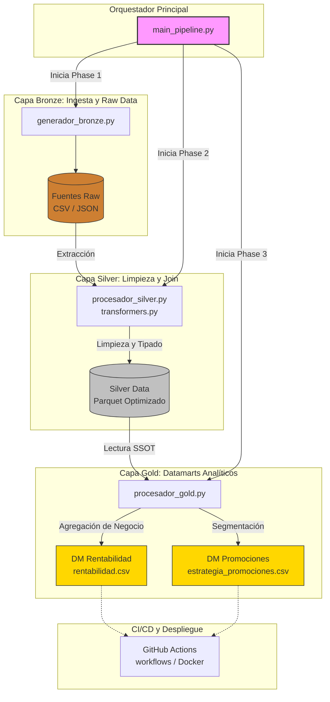

# Arquitectura del Pipeline de Datos (Proyecto Maderera)

Este documento describe la arquitectura técnica del pipeline de datos construido para la empresa maderera. El sistema está diseñado bajo el patrón **Medallion Architecture**, garantizando trazabilidad, escalabilidad y calidad de los datos generados.

## 1. Diagrama de Arquitectura de Alto Nivel

## 2. Descripción de Componentes

### 2.1 Orquestación (`main_pipeline.py`)
Es el punto de entrada principal del sistema. En lugar de ejecutar scripts sueltos, este script maestro coordina secuencialmente la ejecución de las tres capas. Provee instrumentación (tiempo de ejecución de cada paso) y registra el paso de la data a través de las tuberías.

### 2.2 Capa Bronze (Datos Crudos)
- **Propósito:** Actuar como el lago de datos crudo temporal donde la información de origen aterriza tal cual como se generó.
- **Entidades procesadas:** Catálogo de maderas, registro de clientes, historial de ventas y sus detalles.
- **Mecanismo:** El script `generador_bronze.py` simula/recibe la ingesta inicial guardando los datos sin alteraciones para mantener la trazabilidad.

### 2.3 Capa Silver (Single Source of Truth)
- **Propósito:** Limpiar, homologar y consolidar la información. 
- **Mecanismo:** Mediante programación orientada a objetos en `transformers.py` y el controlador `procesador_silver.py`, la data sufre transformaciones severas:
  - Eliminación de registros vacíos (*null handling*).
  - Normalización de tipos de datos (fechas reales y montos numéricos).
  - Unión inteligente (Joins) creando una base transaccional maestra.
- **Almacenamiento:** Lo ideal en esta capa es trabajar con formato Parquet para la eficiencia de I/O de lectura/escritura en los siguientes pasos.

### 2.4 Capa Gold (Capa de Negocio)
- **Propósito:** Responder inmediatamente a las preguntas críticas de la gerencia sin que BI tenga que recostruir los datos.
- **Mecanismo:** `procesador_gold.py` se encarga de tomar la verdad absoluta de *Silver* y calcular métricas derivadas (sumatorias, KPIs, segmentación).
- **Entregables (Datamarts):**
  - `rentabilidad.csv`: Cruce de datos que revela las ganancias puras por tipo de madera vendida.
  - `estrategia_promociones.csv`: Listado de comportamientos de clientes y recomendador de promociones.

## 3. Estrategia Cloud y Despliegue (CI/CD)

El repositorio está equipado para entornos Multi-Cloud (AWS/GCP):
- **Contenedores:** Soporte para empaquetado en imágenes Docker. Esto asegura que el pipeline se ejecuta igual en la computadora del desarrollador y en el servidor local.
- **Automatización de CI/CD:** Mediante archivos en `.github/workflows/` (ej: `deploy-aws.yml`, `deploy-gcp.yml`), cualquier actualización a la rama *master* desencadena flujos que testean la integridad del pipeline y construyen una nueva versión lista para funcionar en la nube de Amazon Web Services (ECS/Batch) o Google Cloud Platform (Cloud Run/Compute Engine).
